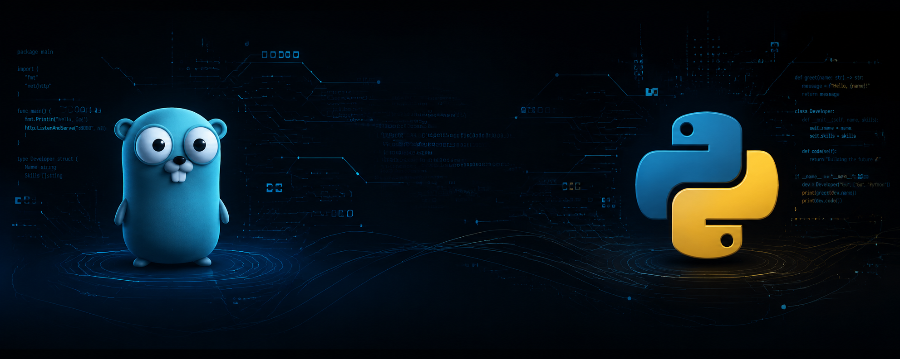

# Go Backend Developer

  

p>

## About Me
I am a Backend Developer specializing in scalable systems and microservices with Go and Python.

* Backend: Microservices design and distributed systems.
* * Event-Driven: Kafka and asynchronous data pipelines.
  * * Data: PostgreSQL, ClickHouse, and Redis.
   
    * ## Tech Stack
    * Go, Python, PostgreSQL, Kafka, Redis, Docker, Kubernetes, Prometheus, Grafana.
    * 
